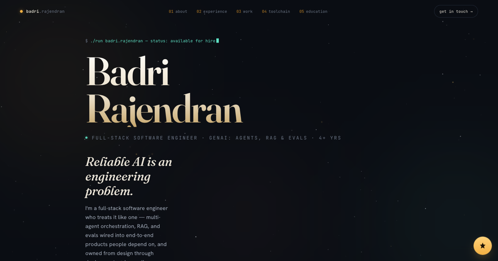

# Badri Rajendran — Full-Stack Software Engineer · GenAI — Portfolio

> **Reliable AI is an engineering problem. I build production LLM systems that treat it like one.**

A personal portfolio for a **full-stack software engineer** with 4+ years building end-to-end systems — currently working in production **GenAI**: **LLM agents, RAG, and evals**. The whole site is static files with zero dependencies and no build step, and the page renders like an *agent execution trace* — a gold SVG filament draws itself down the page as you scroll, a comet-head walks its leading edge, and each section ignites as a node in the graph. Over a living night-sky background, the cursor is replaced by a glowing star that trails stardust.

<p align="center">
  <a href="https://badri-rajendran.github.io"></a>
  
  
  
  
  
</p>

<p align="center">
  <a href="https://badri-rajendran.github.io"><strong>🔭 View the live site →</strong></a>
</p>



---

## ✨ Highlights

- **A scroll-following SVG path** — a single filament is generated through anchor points with Catmull-Rom smoothing, drawn on scroll via `stroke-dashoffset`, with a traveling comet-head (`getPointAtLength`) and section nodes that activate as you arrive.
- **A night-sky star-trail cursor** — the native cursor is hidden and replaced by an eased glowing star that trails gold stardust, chased by a small 5-star constellation with spring physics; background stars brighten and lean toward the pointer as it passes.
- **Data-driven content** — every project, role, and skill lives in one `DATA` object. Adding a project is a one-object edit; no markup to touch.
- **Badri's AI** — a floating chat widget that answers questions about my career, projects, experience, and education, streamed from a small serverless endpoint so the OpenAI key never reaches the browser.
- **Zero build, zero dependencies** — static files (`index.html` plus the widget in `assets/`). Drop them on any static host and they just work.
- **Responsive & accessible** — fluid layouts, a mobile menu, `focus-visible` styles, and full `prefers-reduced-motion` support that disables the trail/animation and restores the native cursor.

---

## 🧠 The concept

Most engineering portfolios reach for the same dark-mode-plus-neon template. This one is built around a single idea drawn from the work it showcases: **the page behaves like an agent execution trace.**

As you scroll, a gold filament threads the page top to bottom, weaving left and right through each section. A comet-head rides its leading edge, and every section is a *node* in the graph that lights up the moment the trace reaches it. It's a small piece of narrative that ties the visual design directly to the domain — multi-agent orchestration, graphs, and execution flow — instead of decorating around it.

---

## 🛠️ Built with

| Layer | Choice | Why |
| --- | --- | --- |
| Markup & styles | **Vanilla HTML + CSS** | No framework tax; ships as static files, loads instantly. |
| Scroll trace | **SVG** + `getTotalLength` / `getPointAtLength` | Crisp at any zoom; precise control over draw progress and node timing. |
| Night sky & cursor | **Canvas 2D** + `requestAnimationFrame` | Smooth many-particle animation that SVG can't match at this density. |
| Reveal & scroll-spy | **IntersectionObserver** | Cheap, jank-free section reveals and active-nav tracking. |
| Type | Fraunces · Hanken Grotesk · JetBrains Mono | Editorial display, clean body, monospace "machine voice." |
| Chat widget | **Vanilla JS** + `fetch` streaming (server-sent events) | Answers type out live; model output is rendered as text nodes, never HTML. |
| Chat endpoint | **Python** Cloud Run function + **OpenAI Responses API** | Keeps the API key server-side; rate-limited and CORS-locked to this site. |
| Hosting | **GitHub Pages** | Free static hosting, no pipeline. |

---

## ⚙️ How it works

A few decisions worth calling out, since they're the interesting part:

- **Two canvases, one loop.** A background `#sky` canvas (behind content) holds the starfield and its cursor-reactive parallax; a foreground `#fx` canvas (above everything, `pointer-events: none`) draws the cursor head, stardust, and chasing constellation. Both are driven by a single animation loop.
- **DPR-aware & paused when hidden.** Canvases scale to `devicePixelRatio` (capped at 2 for performance), particle counts are bounded, and the loop pauses on `visibilitychange` to avoid burning cycles in a backgrounded tab.
- **The trace is rebuilt, not hard-coded.** The path is recomputed from live DOM positions on load, resize, and `document.fonts.ready`, so it stays aligned even as content reflows.
- **Progressive enhancement.** The custom cursor is only enabled on fine-pointer devices and when motion is allowed — so touch users and anyone with reduced-motion preferences get a clean, fully-functional fallback.

---

## 🤖 Badri's AI

A chat widget in the bottom-right corner answers visitors' questions about me, in my voice, with a clear note that it's an AI.

```
GitHub Pages (static)                       GCP Cloud Run function                        OpenAI
index.html + assets/badri-ai.{js,css} ──POST──▶ CORS → validate → rate-limit ──▶ Responses API
              ◀──── server-sent events ─────  system prompt from server/knowledge/*.md
```

- **Why a backend at all:** an API key used by the browser is public. The key lives in GCP Secret Manager; the site stays static.
- **What it knows:** everything in `server/knowledge/badri.md` (public) and an optional git-ignored `private.md`. No RAG — it all fits in one cached system prompt.
- **Guardrails:** per-IP and daily limits, message-size caps, code in messages rejected, answers grounded only in the provided facts.
- **Local setup and tests:** see [`server/README.md`](server/README.md). Design notes: [`docs/badri-ai-chatbot-design.md`](docs/badri-ai-chatbot-design.md).

---

## 🚀 Run locally

```bash
git clone https://github.com/Badri-Rajendran/Badri-Rajendran.github.io.git
cd Badri-Rajendran.github.io

# open it directly...
open index.html            # macOS  (use 'start' on Windows / 'xdg-open' on Linux)

# ...or serve it (recommended, so relative links resolve cleanly)
python3 -m http.server 8000   # then visit http://localhost:8000
```

No install step, no bundler, no `node_modules`. To try the chat widget locally, also run the endpoint on port 8080 (see [`server/README.md`](server/README.md)) and open the site at `http://localhost:8000`.

---

## 🌐 Deploy to GitHub Pages

1. Push `index.html` and `assets/` (plus `preview.png` and `BadriRajendran_Resume.pdf`) to the repo root. `_config.yml` keeps `server/` and `docs/` off the published site.
2. **Settings → Pages → Source:** deploy from `main`, folder `/ (root)`.
3. If the repo is named `Badri-Rajendran.github.io`, it goes live at the root domain automatically:

```
https://badri-rajendran.github.io
```

---

## 🧩 Customizing the content

All editable content lives in a single `DATA` object near the top of the inline `<script>`, marked **`HOW TO EDIT YOUR CONTENT`**. To add a project, push one object into `DATA.projects.others`:

```js
{
  title: 'My New Project',
  subtitle: 'One-line tagline',
  blurb: "What it does — accents with <b>bold</b> and <span class='num'>40%</span>.",
  tags: ['Python', 'FastAPI'],
  lang: { name: 'Python', color: '#3572A5' },
  icon: 'graph',                       // graph | pulse | building | chart | book
  links: [{ label: 'Source', url: 'https://github.com/...', kind: 'github' }]
}
```

It renders automatically. Experience, skills, and social links are edited the same way in the same object — there's no other markup to update.

> **Keep Badri's AI in sync:** the chatbot answers from `server/knowledge/badri.md`, not from `DATA`. When you change `DATA`, update that file too and redeploy the endpoint.

---

## 👋 About me

I'm **Badri Rajendran**, a **full-stack software engineer** in the San Francisco Bay Area with **4+ years** building end-to-end web, mobile, and backend systems in Java/Spring, Python, and TypeScript — currently working in production GenAI: **multi-agent orchestration, RAG, LLM evals, and MCP servers**, held to real reliability bars.

- 💼 Currently **GenAI Engineer Intern at Presenter Prep** (Mountain View, CA) — LLM-as-Judge evals over Gemini native-audio responses, a retrieval-grounded chatbot with tool calling, and full-stack work on React/TypeScript with a serverless Cloudflare backend.
- 🤖 Flagship: **PolicyPal** — a grounded RAG assistant for insurance questions with cited answers (React · Flask · hybrid BM25 + pgvector retrieval · open-source Hugging Face embedding and reranking models · evals with regression floors), now adding ACA Marketplace plan comparison. Also built **CodeSage** — a Claude-powered multi-agent PR reviewer on LangGraph (pgvector RAG · LLM-as-Judge evals · MCP server).
- 🎓 **M.S. Computer Science**, Stevens Institute of Technology · **B.E. Computer Science**, Anna University.
- 🧭 Open to **Software Engineer, Full-Stack, and GenAI Engineer roles**.

📄 **[Download my résumé](BadriRajendran_Resume.pdf)**

---

## 📫 Connect

| | |
| --- | --- |
| 📧 Email | [badriathindran@gmail.com](mailto:badriathindran@gmail.com) |
| 💼 LinkedIn | [badri-rajendran](https://www.linkedin.com/in/badri-rajendran/) |
| 🐙 GitHub | [@Badri-Rajendran](https://github.com/Badri-Rajendran) |
| 🐦 X / Twitter | [@badhrirajen](https://x.com/badhrirajen) |
| 📺 YouTube | [@BadriRajendran](https://youtube.com/@BadriRajendran) |
| 🧮 LeetCode | [badhri_rajendran](https://leetcode.com/u/badhri_rajendran/) |
| 🏅 Codeforces | [badhrirajen](https://codeforces.com/profile/badhrirajen) |

---

## 📝 License

Released under the **MIT License** — the code is free to learn from and reuse. Please don't redeploy the site as your own personal portfolio or reuse my résumé, photos, and written content.

<p align="center"><sub>Designed & built in the Bay Area · 2026 — a page that renders as an agent execution trace.</sub></p>